# NRFGate -- Program Flow

> Rendered with [Mermaid](https://mermaid.js.org/). GitHub renders this natively.

```mermaid
flowchart TD
    A([Power On / Reset]) --> B

    subgraph BOOT ["1. Boot  (src/main.c:51-68)"]
        B["main()<br/>print: BLE Mesh Gateway starting"]
        B --> C["dk_buttons_init(button_handler)<br/>Register Button-1 GPIO interrupt"]
        C --> D["bt_enable(bt_ready)<br/>Start BT stack -- async"]
    end

    D -->|"BT stack ready (async callback)"| E

    subgraph INIT ["2. Mesh Init  (main.c:8-39, model_handler.c:362-380)"]
        E["bt_ready()"]
        E --> F["dk_leds_init()"]
        F --> G["model_handler_prov_init()<br/>hwinfo_get_device_id -> prov_uuid<br/>Return provisioning struct"]
        G --> H["model_handler_comp_init()<br/>Register models:<br/>- CFG_SRV, CFG_CLI<br/>- HEALTH_SRV<br/>- SENSOR_CLI 0x1102<br/>Start config_wq work-queue thread"]
        H --> I["bt_mesh_init(prov, comp)"]
        I --> J{"CONFIG_SETTINGS<br/>enabled?"}
        J -->|Yes| K["settings_load()<br/>Restore state from flash"]
        J -->|No| L
        K --> L["model_handler_self_provision()"]
    end

    subgraph PROV ["3. Self-Provisioning  (model_handler.c:274-319)"]
        L --> M{"bt_mesh_is_provisioned()?"}
        M -->|"Yes -- already provisioned"| N["Skip provisioning<br/>Schedule configure_work immediately<br/>settings_load restored net/app keys"]
        M -->|"No -- fresh boot"| O["bt_mesh_cdb_create(net_key)<br/>Create mesh CDB with<br/>hardcoded net_key<br/>(pre-shared with all sensor nodes)"]
        O --> P["bt_mesh_provision(<br/>  net_key, NET_IDX=0x000,<br/>  addr=GATEWAY_ADDR=0x0001,<br/>  dev_uuid<br/>)<br/>Assigns gateway unicast address"]
        P -->|"prov_complete() callback"| Q["configure_retry_count = 0<br/>Schedule configure_work K_NO_WAIT"]
        N --> Q
    end

    subgraph CFG ["4. Post-Provisioning Config  (model_handler.c:207-261)"]
        Q --> R["configure_handler()<br/>Runs in config_wq thread<br/>(not BT callback -- safe for cfg_cli calls)"]
        R --> S["bt_mesh_app_key_add(<br/>  APP_IDX=0x000, net_key, app_key<br/>)"]
        S --> T{"Error?<br/>-EALREADY is OK"}
        T -->|Fatal error| RETRY
        T -->|OK| U["bt_mesh_cfg_cli_mod_app_bind(<br/>  GATEWAY_ADDR, APP_IDX,<br/>  SENSOR_CLI 0x1102<br/>)<br/>Allow model to send/recv app messages"]
        U --> V{"Error?"}
        V -->|Error| RETRY
        V -->|OK| W["bt_mesh_cfg_cli_mod_sub_add(<br/>  GATEWAY_ADDR,<br/>  GROUP_ADDR=0xC000<br/>)<br/>Subscribe to multicast --<br/>all sensors publish here"]
        W --> X{"Error?"}
        X -->|Error| RETRY
        X -->|OK| Y{"CONFIG_SETTINGS?"}
        Y -->|Yes| Z["settings_save()<br/>Persist keys + subscriptions<br/>so next reboot skips re-provisioning"]
        Y -->|No| IDLE
        Z --> IDLE

        RETRY(["schedule_retry()<br/>delay = 500ms << min(count,4)<br/>max 8s backoff<br/>Re-queue configure_work"])
        RETRY -->|"next attempt"| R
    end

    IDLE(["5. Idle -- Listening on 0xC000<br/>Gateway waits for BLE Mesh<br/>Sensor Status messages"])

    IDLE -->|"Button 1 pressed (any time)"| BTN

    subgraph RESET ["6. Factory Reset  (main.c:41-49)"]
        BTN["button_handler()<br/>DK_BTN1_MSK detected"]
        BTN --> BR1["bt_mesh_cdb_clear()<br/>Erase mesh CDB"]
        BR1 --> BR2["bt_mesh_reset()<br/>Reset BLE Mesh stack"]
        BR2 --> BR3["sys_reboot(SYS_REBOOT_WARM)<br/>Full restart"]
        BR3 --> A
    end

    IDLE -->|"BLE Mesh message arrives opcode 0x52"| RX

    subgraph RX_PROC ["7. Sensor Data RX  (model_handler.c:179-190)"]
        RX["sensor_status_handler(<br/>  model, ctx, buf<br/>)<br/>Triggered by BT stack<br/>for SENSOR_CLI model"]
        RX --> RX2["process_sensor_status(<br/>  ctx, buf->data, buf->len<br/>)"]
        RX2 --> RX3["LOG: Sensor Status from 0xXXXX (N bytes)"]
    end

    RX3 --> PARSE

    subgraph PARSE_LOOP ["8. MPID Parsing Loop  (model_handler.c:98-173)"]
        PARSE{"offset < len?"}
        PARSE -->|"No -- done"| IDLE
        PARSE -->|Yes| PA["Read 2-byte MPID<br/>mpid = data[offset] | data[offset+1] << 8"]
        PA --> PB["parse_mpid_format_a(mpid)<br/>Bit 0=0 -> Format A<br/>bits 1-4 -> data_len-1<br/>bits 5-15 -> prop_id"]
        PB --> PC{"Format A?"}
        PC -->|"No -- Format B not supported"| IDLE
        PC -->|Yes| PD["Advance offset +2<br/>read N bytes of value"]
        PD --> PE{"prop_id?"}

        PE -->|0x004F| T1["PROP_TEMPERATURE<br/>int16 / 100 -> C<br/>LOG: Temperature: X.XX C"]
        PE -->|0x0076| T2["PROP_HUMIDITY<br/>uint16 / 100 -> %<br/>LOG: Humidity: X.XX %"]
        PE -->|0x0008| T3["PROP_ECO2<br/>uint16 -> ppm<br/>LOG: eCO2: X ppm"]
        PE -->|0x0102| T4["PROP_TVOC<br/>uint16 -> ppb<br/>LOG: TVOC: X ppb"]
        PE -->|0x0100| T5["PROP_HEART_RATE<br/>uint8 -> bpm<br/>LOG: Heart Rate: X bpm"]
        PE -->|0x0101| T6["PROP_SPO2<br/>uint8 -> %<br/>LOG: SpO2: X %"]
        PE -->|0x0103| T7["PROP_RAW_RED<br/>uint32 -> ADC count<br/>LOG: Raw RED: X"]
        PE -->|0x0104| T8["PROP_RAW_IR<br/>uint32 -> ADC count<br/>LOG: Raw IR: X"]
        PE -->|unknown| T9["LOG_WRN: Unknown property 0xXXXX"]

        T1 --> PARSE
        T2 --> PARSE
        T3 --> PARSE
        T4 --> PARSE
        T5 --> PARSE
        T6 --> PARSE
        T7 --> PARSE
        T8 --> PARSE
        T9 --> PARSE
    end

    style BOOT  fill:#1a3a5c,stroke:#4a8cc7,color:#cde
    style INIT  fill:#1a3a5c,stroke:#4a8cc7,color:#cde
    style PROV  fill:#1a4a2e,stroke:#4ac770,color:#cec
    style CFG   fill:#3a2a1a,stroke:#c7844a,color:#dec
    style RX_PROC fill:#2a1a3a,stroke:#844ac7,color:#dce
    style PARSE_LOOP fill:#2a1a3a,stroke:#844ac7,color:#dce
    style RESET fill:#3a1a1a,stroke:#c74a4a,color:#ecc
    style RETRY fill:#5a3010,stroke:#c7844a,color:#fed
    style IDLE  fill:#0f2a0f,stroke:#4ac770,color:#cfc
```

---

## Phase Summary

| # | Phase | Trigger | Key File |
|---|-------|---------|----------|
| 1 | Boot | Power on | `src/main.c:51` |
| 2 | Mesh Init | BT stack ready (async) | `src/main.c:8`, `model_handler.c:362` |
| 3 | Self-Provisioning | bt_mesh_init complete | `model_handler.c:274` |
| 4 | Auto-Config | prov_complete() callback | `model_handler.c:218` |
| 5 | Idle / Listen | Config success | -- |
| 6 | Factory Reset | Button 1 GPIO interrupt | `src/main.c:41` |
| 7 | Sensor RX | BLE Mesh opcode 0x52 | `model_handler.c:179` |
| 8 | MPID Parse Loop | process_sensor_status | `model_handler.c:98` |

## Why Things Work the Way They Do

| Design Choice | Reason |
|---|---|
| Hardcoded `net_key` / `app_key` | Self-provisioning requires pre-shared keys -- no external provisioner |
| Config runs in a dedicated `config_wq` thread | `bt_mesh_cfg_cli_*` calls block; running them inside a BT callback would deadlock |
| Exponential backoff on config retries | Config client calls can fail transiently while the mesh stack finishes initializing |
| `GROUP_ADDR 0xC000` multicast | All sensor nodes publish to one address; gateway subscribes once instead of per-node |
| `settings_save()` after config | Persists keys + subscriptions to flash so warm reboots skip re-provisioning |
| MPID Format A only | Format B supports larger property IDs (>0x7FF); sensor nodes only use SIG IDs <= 0x01FF |